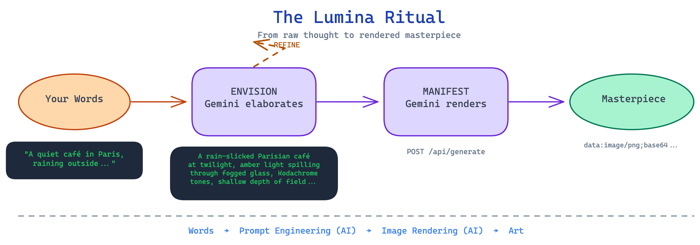
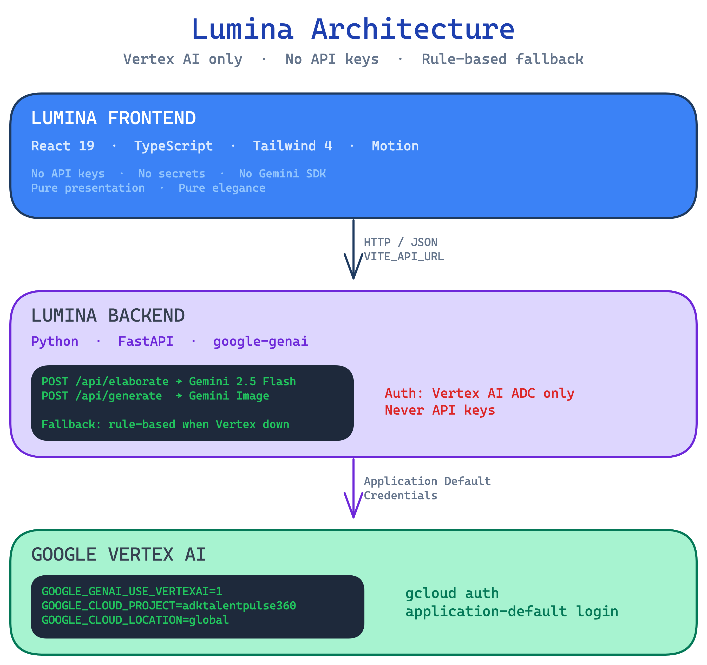

<div align="center">

<br>
<br>

```
                    ·  ✦  ·
              ·  ·  ·     ·  ·  ·
           ·        L U M I N A        ·
              ·  ·  ·     ·  ·  ·
                    ·  ✦  ·
```

<br>

# L&thinsp;U&thinsp;M&thinsp;I&thinsp;N&thinsp;A

### *The Art of the Prompt*

<br>

[](https://cloud.google.com/vertex-ai)
[](https://react.dev)
[](https://fastapi.tiangolo.com)
[](https://deepmind.google/technologies/gemini/)
[](https://www.typescriptlang.org)
[](https://tailwindcss.com)

<br>

*Where words become worlds.*

---

<br>

<table>
<tr>
<td width="33%" align="center">
<br>
<h3>01</h3>
<b>E N V I S I O N</b>
<br><br>
<em>Describe a situation.<br>Add your details.<br>The oracle elaborates.</em>
<br><br>
</td>
<td width="33%" align="center">
<br>
<h3>02</h3>
<b>R E F I N E</b>
<br><br>
<em>Read the master prompt.<br>Adjust. Iterate.<br>Until perfection.</em>
<br><br>
</td>
<td width="33%" align="center">
<br>
<h3>03</h3>
<b>M A N I F E S T</b>
<br><br>
<em>One click.<br>Vision rendered.<br>A masterpiece born.</em>
<br><br>
</td>
</tr>
</table>

<br>

</div>

---

<br>

<div align="center">

> *"Most tools treat the prompt as a throwaway. Lumina treats it as the masterpiece itself."*

</div>

<br>

## The Philosophy

There is a moment — between the thought and the image — where the magic actually lives. That moment is **the prompt**. Every great image begins with one precise, evocative sentence that captures light, atmosphere, emotion, and intent.

**Lumina** is built on this belief. It does not rush you to a generated image. Instead, it dedicates Gemini's deepest intelligence to *one task*: crafting the perfect prompt. You describe a scene in your own words. The system transforms it into something extraordinary. You refine it, shape it, make it yours. Only then — when the words are right — do you manifest the image.

This is not a tool. It is a **ritual**.

<br>

---

<br>

<div align="center">

### Lumina's First Creation

<br>


<br>

<sub>*A quiet café at night, rain on glass, warm light, an open notebook — manifested from words alone.*</sub>

<br>
<br>

</div>

---

<br>

<div align="center">



</div>

<br>

---

<br>

## Design Language

<table>
<tr>
<td width="50%">

### Typography
**Cormorant Garamond** — a serif with centuries of heritage, chosen for its ability to make words feel like they matter. Paired with **Inter** for interface clarity. The contrast between editorial elegance and functional precision mirrors Lumina's dual nature: *art and engineering*.

### Palette
Three colors. That's all.
- **Ink** `#050505` — the void from which images emerge
- **Paper** `#f5f2ed` — warm, human, alive
- **Gold** `#d4af37` — the accent that says *this matters*

</td>
<td width="50%">

### Motion
Every transition is deliberate. Elements enter from the right, exit to the left — a reading direction that feels natural, never jarring. Loading states pulse like a heartbeat. The spinner is a single white arc rotating in void. No bounce. No jitter. Just breath.

### Glass
Panels float on `backdrop-filter: blur(20px)` with 3% opacity and 8% borders. They suggest depth without competing with content. The interface disappears so the words — and eventually the image — can take center stage.

</td>
</tr>
</table>

<br>

---

<br>

## Architecture

<div align="center">



</div>

<br>

---

<br>

## Principles

<table>
<tr>
<td align="center" width="25%">
<br>
<h3>✦</h3>
<b>Vertex AI Only</b>
<br><br>
All Gemini traffic routes through the backend with <code>GOOGLE_GENAI_USE_VERTEXAI=1</code>. No API key authentication — ever. ADC is the only path.
<br><br>
</td>
<td align="center" width="25%">
<br>
<h3>✦</h3>
<b>AI Is Optional</b>
<br><br>
The system must work without Gemini. Prompt elaboration falls back to rule-based templates. Image generation requires Vertex but fails with clarity, not crashes.
<br><br>
</td>
<td align="center" width="25%">
<br>
<h3>✦</h3>
<b>One Package</b>
<br><br>
Backend uses <code>google-genai</code>. Not <code>google-generativeai</code>. Not LangChain. One dependency for all AI. Simplicity is elegance.
<br><br>
</td>
<td align="center" width="25%">
<br>
<h3>✦</h3>
<b>Beauty as Default</b>
<br><br>
Typography, motion, palette, and spacing are not afterthoughts. They are the product. Every pixel is intentional. Every transition is earned.
<br><br>
</td>
</tr>
</table>

<br>

---

<br>

## Quick Start

<details>
<summary><b>① &ensp; Backend — The Mind</b></summary>
<br>

The backend is the only component that speaks to Gemini. It authenticates via Vertex AI ADC — no API key.

```bash
cd backend
python -m venv .venv && source .venv/bin/activate
pip install -r requirements.txt
```

Set the Vertex AI environment:

```bash
export GOOGLE_GENAI_USE_VERTEXAI=1
export GOOGLE_CLOUD_LOCATION=global
export GOOGLE_CLOUD_PROJECT=adktalentpulse360
```

Authenticate:

```bash
gcloud auth application-default login
```

Start:

```bash
uvicorn main:app --reload --host 0.0.0.0 --port 8000
```

<br>

**Optional model overrides:**

| Variable                 | Default                          | Purpose                  |
|--------------------------|----------------------------------|--------------------------|
| `LUMINA_MODEL_ELABORATE` | `gemini-2.5-flash`               | Prompt elaboration model |
| `LUMINA_MODEL_IMAGE`     | `gemini-2.5-flash-preview-05-20` | Image generation model   |

<br>
</details>

<details>
<summary><b>② &ensp; Frontend — The Face</b></summary>
<br>

```bash
npm install
npm run dev
```

The frontend calls `http://localhost:8000` by default. To point to a deployed backend:

```bash
VITE_API_URL=https://your-backend.example.com npm run dev
```

Build for production:

```bash
npm run build
```

<br>
</details>

<br>

---

<br>

## Environment Reference

<div align="center">

| Variable                    | Where    | Purpose                                        |
|:----------------------------|:---------|:-----------------------------------------------|
| `GOOGLE_GENAI_USE_VERTEXAI` | Backend  | **Required.** Must be `1`. Enables Vertex AI.  |
| `GOOGLE_CLOUD_LOCATION`     | Backend  | Region. Use `global` for preview models.       |
| `GOOGLE_CLOUD_PROJECT`      | Backend  | GCP project ID (e.g. `adktalentpulse360`).     |
| `VITE_API_URL`              | Frontend | Backend URL. Default: `http://localhost:8000`. |

<br>

> **No `GEMINI_API_KEY` or any API key is used. Authentication is via Application Default Credentials only.**

</div>

<br>

---

<br>

## The Stack

<div align="center">

| Layer            | Technology                                  | Role                                      |
|:-----------------|:--------------------------------------------|:------------------------------------------|
| **Interface**    | React 19 · TypeScript · Tailwind 4 · Motion | Presentation, animation, interaction      |
| **Typography**   | Cormorant Garamond · Inter                  | Editorial beauty meets functional clarity |
| **API**          | FastAPI · Pydantic                          | Typed, documented, fast                   |
| **Intelligence** | google-genai · Vertex AI · Gemini 2.5       | Prompt elaboration and image generation   |
| **Auth**         | Application Default Credentials             | Vertex AI only. No keys.                  |
| **Build**        | Vite 6                                      | Lightning-fast HMR and bundling           |

</div>

<br>

---

<br>

<div align="center">

```
                    ·  ✦  ·
```

<br>

### *Every great image begins with one perfect sentence.*

<br>

**L&thinsp;U&thinsp;M&thinsp;I&thinsp;N&thinsp;A** — where words become worlds.

<br>
<br>

<sub>Built with conviction. Designed with restraint. Powered by Vertex AI.</sub>

<br>
<br>

</div>
